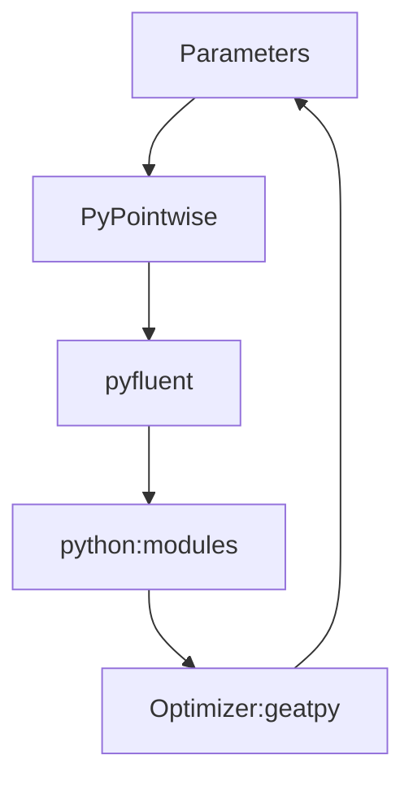

# PyCFD
Coding for CFD solver for applications in aerodynamical MDO project. 

The process for the 2d solution as follows:

- parameterization by `python'
- mesh by `PyPointwise`
- simulation by `pyfluent`
- post-process by `python`
- optimization by `geatpy`

